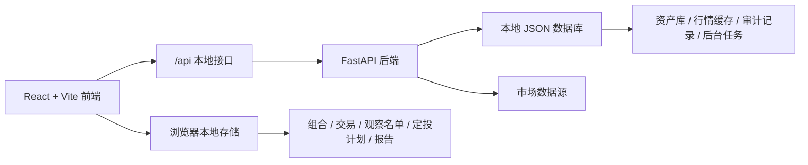
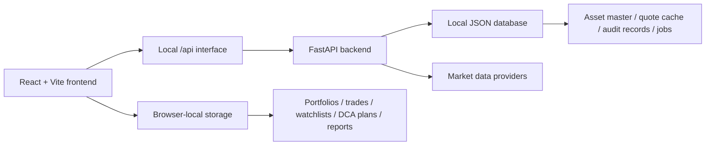
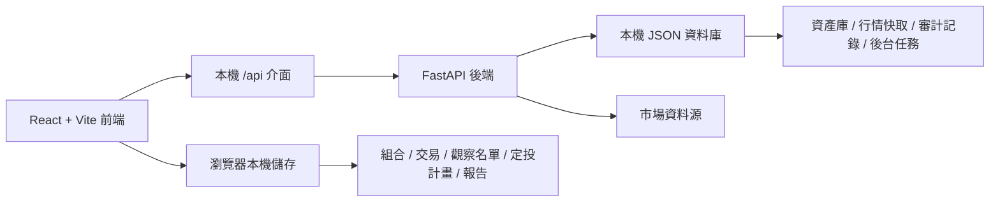

# FundX


FundX is a US-market portfolio management system for fund discovery, portfolio construction, DCA planning, custom fund modeling, asset comparison, watchlists, and investment reporting.

语言 / Languages: [简体中文](#简体中文) · [English](#english) · [繁體中文](#繁體中文)

---

## 简体中文

### 系统简介

FundX 是一个面向美股市场的本地化投资组合管理系统。它把基金筛选、股票跟踪、组合构建、定投模拟、自定义基金、资产比较、观察名单和投资报告整合在一个工作台里，帮助投资者把分散的研究、记录和复盘流程集中起来。

系统适合用于个人投资研究、长期组合跟踪、基金/股票横向比较、定投计划测算、持仓再平衡分析，以及本地保存投资报告。

### 解决的问题

- **信息分散**：把基金、股票、组合、观察名单和报告放在同一个系统中管理。
- **组合难以复盘**：通过组合快照、资产曲线、收益指标和持仓结构记录投资变化。
- **定投计划难以量化**：用 DCA 模拟器计算不同投入频率、金额、费用和股息再投方式的结果。
- **自建组合缺少结构分析**：自定义基金模块支持权重校验、行业暴露和资产贡献分析。
- **基金比较不直观**：比较模块集中展示收益、波动、回撤、费率、股息和持仓信息。
- **个人数据不适合放到远端**：组合、交易、定投计划、观察名单和报告默认保存在浏览器本地。

### 系统设计



- 前端使用 React、TypeScript、Vite、React Router、Tailwind CSS 和 Zustand。
- 后端使用 FastAPI，提供统一的本地 `/api` 服务。
- 本地 JSON 数据库保存公开资产数据、行情缓存和运行记录。
- 用户投资数据默认保存在浏览器本地，便于个人使用和导入导出。
- 系统当前聚焦美股市场，使用 USD、美股行业分类和常见美股基准。
- 行情数据按需刷新；当数据源不可用时，系统保留明确的数据状态，不生成虚假行情。

### 功能模块

- **Home**：展示组合或自定义基金的总览、资产曲线、核心指标、Top 股票和 Top 基金。
- **Discover**：搜索基金，按类型、行业、指标和关键词筛选资产，并进入详情或比较流程。
- **Portfolio**：创建和编辑投资组合，维护持仓、目标权重、现金流、交易记录和组合快照。
- **DCA Lab**：模拟定投计划，支持投入频率、投入金额、费用、股息再投、现金流明细和结果曲线。
- **Custom Fund**：从美股资产池中创建自定义基金，设置成分权重，查看行业暴露和收益表现。
- **Compare**：横向比较多只基金或资产，查看收益、波动、回撤、费率、股息和持仓差异。
- **Watchlist**：维护观察名单，跟踪关注资产的价格状态和刷新结果。
- **Insights**：保存组合洞察、资产建议和分析结果，辅助后续复盘。
- **Reports**：生成投资报告，预览组合结构、表现曲线、持仓明细和关键结论。
- **Settings**：配置语言、主题、市场颜色、数据导入导出和数据源状态。

### 本地部署

安装前端依赖和后端依赖：

```bash
npm install
python3 -m pip install -r requirements.txt
```

准备本地环境文件和数据库：

```bash
cp .env.example .env.local
node scripts/db.mjs init
node scripts/db.mjs migrate
```

启动后端服务：

```bash
npm run dev:api
```

启动前端服务：

```bash
npm run dev
```

访问本地地址：

```text
http://localhost:3000
```

本地开发时，前端监听 `http://localhost:3000`，后端监听 `http://127.0.0.1:8000`，前端的 `/api` 请求会代理到后端服务。

### 本地生产模式

构建前端产物：

```bash
npm run build
```

启动后端：

```bash
npm run serve:api
```

启动前端预览服务：

```bash
npm run serve:web
```

本地生产模式下，后端监听 `0.0.0.0:8000`，前端预览服务监听 `0.0.0.0:3000`。

---

## English

### Overview

FundX is a local US-market portfolio management system. It brings fund discovery, stock tracking, portfolio construction, DCA simulation, custom fund modeling, asset comparison, watchlists, and investment reporting into one workspace.

The system is designed for personal investment research, long-term portfolio tracking, fund and stock comparison, DCA planning, rebalance analysis, and local report storage.

### Problems It Solves

- **Scattered research**: manage funds, stocks, portfolios, watchlists, and reports in one place.
- **Hard-to-review portfolios**: track snapshots, value curves, return metrics, and allocation structure over time.
- **Unclear DCA outcomes**: simulate contribution frequency, amount, fees, dividend reinvestment, and cash-flow history.
- **Custom baskets lack structure**: build custom funds with weight validation, sector exposure, and contribution analysis.
- **Fund comparison is fragmented**: compare returns, volatility, drawdown, fees, dividends, and holdings side by side.
- **Personal data should stay local**: portfolios, trades, DCA plans, watchlists, and reports are stored in browser-local storage by default.

### System Design



- Frontend: React, TypeScript, Vite, React Router, Tailwind CSS, and Zustand.
- Backend: FastAPI with a unified local `/api` surface.
- Database: local JSON database for public asset records, quote cache, and runtime records.
- User data: investment records are stored in browser-local storage and can be imported or exported.
- Market scope: focused on US assets, USD, US sectors, and common US benchmarks.
- Quote strategy: public market data refreshes on demand and keeps explicit data states when providers are unavailable.

### Features

- **Home**: portfolio and custom fund overview, value curves, core metrics, top stocks, and top funds.
- **Discover**: search funds, filter assets, open details, and start comparisons.
- **Portfolio**: create and edit portfolios, holdings, target weights, cash flows, transactions, and snapshots.
- **DCA Lab**: model contribution schedules, amounts, fees, dividend reinvestment, cash-flow rows, and result curves.
- **Custom Fund**: build a custom fund from US assets, set weights, and review sector exposure and performance.
- **Compare**: compare funds or assets by return, volatility, drawdown, fees, dividends, and holdings.
- **Watchlist**: maintain tracked assets and refresh quote status.
- **Insights**: save portfolio insights, asset recommendations, and analysis results.
- **Reports**: generate reports with allocation, performance curves, holdings, and key conclusions.
- **Settings**: configure language, theme, market color style, import/export, and provider status.

### Local Deployment

Install frontend and backend dependencies:

```bash
npm install
python3 -m pip install -r requirements.txt
```

Prepare local environment and database:

```bash
cp .env.example .env.local
node scripts/db.mjs init
node scripts/db.mjs migrate
```

Start the backend service:

```bash
npm run dev:api
```

Start the frontend service:

```bash
npm run dev
```

Open:

```text
http://localhost:3000
```

During local development, the frontend listens on `http://localhost:3000`, the backend listens on `http://127.0.0.1:8000`, and frontend `/api` requests are proxied to the backend service.

### Local Production Mode

Build the frontend:

```bash
npm run build
```

Start the backend:

```bash
npm run serve:api
```

Start the frontend preview server:

```bash
npm run serve:web
```

In local production mode, the backend listens on `0.0.0.0:8000`, and the frontend preview service listens on `0.0.0.0:3000`.

---

## 繁體中文

### 系統簡介

FundX 是一個面向美股市場的本機投資組合管理系統。它把基金篩選、股票追蹤、組合建構、定投模擬、自訂基金、資產比較、觀察名單與投資報告整合在同一個工作台中。

系統適合用於個人投資研究、長期組合追蹤、基金與股票比較、定投計畫測算、持倉再平衡分析，以及本機保存投資報告。

### 解決的問題

- **資訊分散**：在同一個系統中管理基金、股票、組合、觀察名單與報告。
- **組合難以複盤**：透過組合快照、資產曲線、收益指標與持倉結構記錄投資變化。
- **定投結果難以量化**：用 DCA 模擬器計算不同投入頻率、金額、費用與股息再投方式的結果。
- **自建組合缺少結構分析**：自訂基金模組支援權重校驗、行業暴露與資產貢獻分析。
- **基金比較不直觀**：比較模組集中展示收益、波動、回撤、費率、股息與持倉資訊。
- **個人資料適合留在本機**：組合、交易、定投計畫、觀察名單與報告預設保存在瀏覽器本機。

### 系統設計



- 前端使用 React、TypeScript、Vite、React Router、Tailwind CSS 與 Zustand。
- 後端使用 FastAPI，提供統一的本機 `/api` 服務。
- 本機 JSON 資料庫保存公開資產資料、行情快取與運行記錄。
- 使用者投資資料預設保存在瀏覽器本機，並支援匯入匯出。
- 系統目前聚焦美股市場，使用 USD、美股行業分類與常見美股基準。
- 行情資料按需刷新；當資料源不可用時，系統保留明確的資料狀態。

### 功能模組

- **Home**：組合與自訂基金總覽、資產曲線、核心指標、Top 股票與 Top 基金。
- **Discover**：搜尋基金，篩選資產，查看詳情，進入比較流程。
- **Portfolio**：建立和編輯投資組合、持倉、目標權重、現金流、交易記錄與組合快照。
- **DCA Lab**：模擬定投計畫，支援投入頻率、投入金額、費用、股息再投、現金流明細與結果曲線。
- **Custom Fund**：從美股資產池建立自訂基金，設定成分權重，查看行業暴露與收益表現。
- **Compare**：依收益、波動、回撤、費率、股息與持倉比較基金或資產。
- **Watchlist**：維護觀察名單，追蹤關注資產的價格狀態與刷新結果。
- **Insights**：保存組合洞察、資產建議與分析結果。
- **Reports**：生成投資報告，展示配置、表現曲線、持倉明細與關鍵結論。
- **Settings**：配置語言、主題、市場顏色、資料匯入匯出與資料源狀態。

### 本機部署

安裝前端依賴與後端依賴：

```bash
npm install
python3 -m pip install -r requirements.txt
```

準備本機環境文件與資料庫：

```bash
cp .env.example .env.local
node scripts/db.mjs init
node scripts/db.mjs migrate
```

啟動後端服務：

```bash
npm run dev:api
```

啟動前端服務：

```bash
npm run dev
```

訪問本機地址：

```text
http://localhost:3000
```

本機開發時，前端監聽 `http://localhost:3000`，後端監聽 `http://127.0.0.1:8000`，前端的 `/api` 請求會代理到後端服務。

### 本機生產模式

建置前端產物：

```bash
npm run build
```

啟動後端：

```bash
npm run serve:api
```

啟動前端預覽服務：

```bash
npm run serve:web
```

本機生產模式下，後端監聽 `0.0.0.0:8000`，前端預覽服務監聽 `0.0.0.0:3000`。
