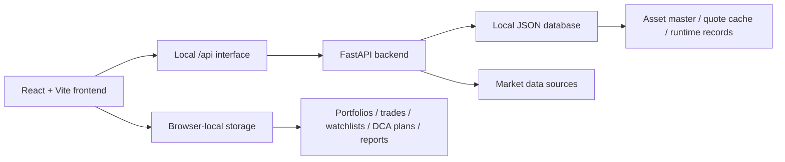

# FundX

<p align="center">
  <strong>A US-market portfolio management system for fund discovery, portfolio construction, DCA planning, custom fund modeling, asset comparison, watchlists, and investment reporting.</strong>
</p>

<p align="center">
  
  
  
  
</p>

---

## Language Pages

| 简体中文 | English | 繁體中文 |
| --- | --- | --- |
| [进入简体中文页面](docs/readme.zh-CN.md) | [Open English page](docs/readme.en.md) | [進入繁體中文頁面](docs/readme.zh-TW.md) |
| 系统介绍、功能说明、本地部署与使用流程。 | Product overview, feature map, local deployment, and workflows. | 系統介紹、功能說明、本機部署與使用流程。 |

---

## Product Snapshot

FundX brings the full personal investment workflow into one workspace: discover assets, build portfolios, simulate recurring investment plans, create custom fund baskets, compare securities, maintain watchlists, and generate reports.

| Workspace | What It Does |
| --- | --- |
| Home | Portfolio overview, value curve, core metrics, top stocks, and top funds. |
| Discover | Fund and asset search with filtering, details, and comparison entry points. |
| Portfolio | Holdings, target weights, transactions, cash flows, snapshots, and allocation views. |
| DCA Lab | Recurring investment simulation with fees, schedule, cash-flow rows, and result curves. |
| Custom Fund | Build weighted baskets from the US asset universe and review exposure and performance. |
| Compare | Side-by-side return, volatility, drawdown, fee, dividend, and holding comparison. |
| Watchlist | Track selected assets and refresh quote status. |
| Insights | Save research conclusions, allocation notes, and reusable analysis results. |
| Reports | Generate investment reports with allocation, performance, holdings, and conclusions. |

## System Shape



## Local Quick Start

```bash
npm install
python3 -m pip install -r requirements.txt
cp .env.example .env.local
node scripts/db.mjs init
node scripts/db.mjs migrate
```

Start the backend:

```bash
npm run dev:api
```

Start the frontend:

```bash
npm run dev
```

Open:

```text
http://localhost:3000
```

For complete documentation, choose one of the language pages above.
