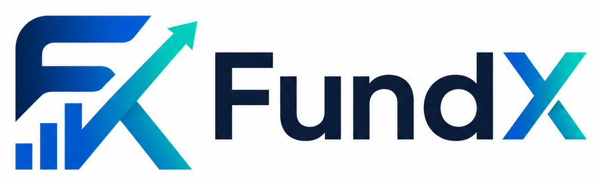
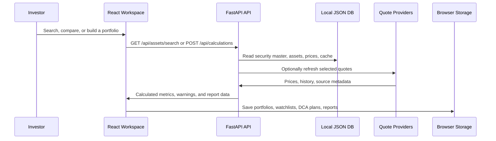
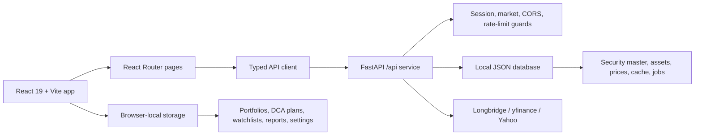

# FundX

<p align="center">
  
</p>

<p align="center">
  <strong>A local-first US-market portfolio workspace for fund discovery, portfolio construction, DCA simulation, custom fund baskets, comparison, watchlists, insights, and investment reports.</strong>
</p>

<p align="center">
  <a href="./README.md"><strong>English</strong></a>
  ·
  <a href="./docs/readme.zh-CN.md">简体中文</a>
  ·
  <a href="./docs/readme.zh-TW.md">繁體中文</a>
</p>

<p align="center">
  
  
  
  
  
  
</p>

<p align="center">
  <a href="#product-capabilities">Product Capabilities</a>
  ·
  <a href="#system-architecture">Architecture</a>
  ·
  <a href="#api-surface">API</a>
  ·
  <a href="#validation-and-quality">Quality</a>
  ·
  <a href="#local-runbook">Local Runbook</a>
</p>

FundX is a local personal investment research system focused on the US market. It combines a React workspace, a FastAPI `/api` service, a local JSON database, seeded public security data, browser-local personal records, and optional live quote refresh into one workflow for researching assets and documenting portfolio decisions.

The current project is intentionally local-first: public market records and quote cache live in the local JSON database, while portfolios, DCA plans, watchlists, saved analyses, reports, and settings stay in browser storage by default unless `FUNDX_USER_DATA_MODE=server` is enabled for a private deployment.

## Problems It Solves

| Question | FundX approach |
| --- | --- |
| Where do I screen US funds and stocks? | Unified Discover, asset detail, top market lists, keyword search, and quote-status visibility |
| How do I review a portfolio decision? | Holdings editor, target weights, cash flows, snapshots, allocation views, and report output |
| What happens if I invest on a schedule? | DCA Lab with contribution frequency, fees, dividend reinvestment, cash-flow rows, and result curves |
| Can I model my own basket? | Custom Fund builder for weighted US assets with exposure, contribution, and backtest-style summaries |
| How do I compare candidates? | Compare workbench for return, volatility, drawdown, fee, dividend, and holdings context |
| Can personal data stay local? | Browser-local persistence, JSON import/export, and server mutation guards in the default mode |

## Product Capabilities

| Module | Main output | Core behavior |
| --- | --- | --- |
| Home | Portfolio and market workspace overview | Value curve, core metrics, top stocks, top funds, custom fund summaries |
| Discover | Searchable US asset universe | Funds and stocks filtered by query, type, sector, category, and metrics |
| Asset Detail | Security research page | Profile, quote status, history, calculated risk/return context, action entry points |
| Portfolio | Portfolio planning workspace | Holdings, quantities, average cost, target weights, cash balance, transactions, snapshots |
| DCA Lab | Recurring investment simulation | Weekly to yearly schedules, transaction costs, dividend reinvestment, result curves |
| Custom Fund | Weighted basket builder | US asset selection, weight validation, sector exposure, contribution, historical curve |
| Compare | Multi-asset comparison | Side-by-side price, return, volatility, drawdown, fee, dividend, and holdings comparison |
| Watchlist | Tracked candidates | Saved assets, target notes, refresh flow, quick navigation to detail pages |
| Insights | Decision memory | Recommendation and analysis result storage for portfolio, DCA, compare, and asset workflows |
| Reports | Investment report output | Portfolio, DCA, and custom-fund reports with JSON, CSV, and simple PDF export paths |
| Settings | Local preferences | Language, theme, benchmark, market color style, provider accounts, import/export |

## Typical Workflow


```mermaid
sequenceDiagram
    participant User as Investor
    participant UI as React Workspace
    participant API as FastAPI API
    participant DB as Local JSON DB
    participant Providers as Quote Providers
    participant Store as Browser Storage

    User->>UI: Search, compare, or build a portfolio
    UI->>API: GET /api/assets/search or POST /api/calculations
    API->>DB: Read security master, assets, prices, cache
    API->>Providers: Optionally refresh selected quotes
    Providers->>API: Prices, history, source metadata
    API->>UI: Calculated metrics, warnings, and report data
    UI->>Store: Save portfolios, watchlists, DCA plans, reports
```

## Supported Market

| Market | Currency | Benchmarks | Asset scope | Data path |
| --- | --- | --- | --- | --- |
| US | USD | S&P 500, Nasdaq 100, Dow Jones, Russell 1000 Value | US stocks, ETFs, funds, custom funds, custom assets | Seeded local DB, quote cache, optional Longbridge, yfinance, and Yahoo chart adapters |

The tracked seed database currently contains `11667` security master records, `11668` assets, `4508` funds, `7159` stocks, and `52445` daily price records. Copying `seed/fundx-public-db.json` into `.fundx/fundx-db.json` gives a local demo database without requiring provider credentials on first launch.

## System Architecture


```mermaid
flowchart LR
    UI["React 19 + Vite app"] --> Router["React Router pages"]
    Router --> Client["Typed API client"]
    Client --> API["FastAPI /api service"]
    API --> Guard["Session, market, CORS, rate-limit guards"]
    API --> DB["Local JSON database"]
    API --> Providers["Longbridge / yfinance / Yahoo"]
    UI --> LocalStore["Browser-local storage"]
    DB --> PublicData["Security master, assets, prices, cache, jobs"]
    LocalStore --> UserData["Portfolios, DCA plans, watchlists, reports, settings"]
```

### Backend Design

- **FastAPI service:** `backend.app.main:app` exposes `/api` routes and can also serve the built Vite app from `dist/`.
- **Local JSON database:** runtime data resolves through `FUNDX_DB_PATH`, `FUNDX_DB_FILE`, `.fundx/fundx-db.json`, then `data/fundx.db.json`.
- **API guardrails:** CORS, request validation, market access checks, read/search/mutation rate limits, read-only sessions, and consistent error payloads are built in.
- **Default local privacy:** browser-local mode blocks server-side mutations for portfolios, watchlists, DCA plans, custom funds, reports, custom assets, imports, and provider-account writes.
- **Quote refresh:** selected-asset and market-latest refreshes are bounded, source-labeled, cached, and protected by provider availability checks and circuit-breaker state.

### Frontend Experience

- React Router routes for `/home`, `/discover`, `/portfolio`, `/dca`, `/custom-fund`, `/compare`, `/watchlist`, `/insights`, `/reports`, `/settings`, `/assets/:id`, and `/funds/:id`.
- Zustand stores hold market, benchmark, currency, theme, color-style, and language preferences.
- Local user data helpers persist portfolios, calculations, histories, reports, watchlists, saved plans, and import/export payloads in the browser.
- UI copy is available in English, Simplified Chinese, and Traditional Chinese.

### Data Boundary

| Data type | Default storage | Notes |
| --- | --- | --- |
| Public security master | Local JSON DB | Seeded from `seed/fundx-public-db.json` and enriched by market-universe jobs |
| Public assets and quote cache | Local JSON DB | Latest price, volume, daily prices, source, quote status, and refresh timestamps |
| Portfolios and holdings | Browser-local storage | Server persistence only when `FUNDX_USER_DATA_MODE=server` |
| DCA plans and custom funds | Browser-local storage | Can be exported/imported as JSON from Settings |
| Watchlists, reports, settings | Browser-local storage | Default API mode returns empty server lists and relies on client state |
| Provider credentials | Environment or provider account settings | Secrets should stay in `.env.local` or deployment secret storage |

## Stack

| Layer | Technology |
| --- | --- |
| Frontend | React 19, React Router 7, TypeScript 5.7, Vite 6, Tailwind CSS, Zustand, Framer Motion, lucide-react |
| Backend | Python 3.11, FastAPI, Uvicorn, Pydantic-backed FastAPI validation |
| Market data | yfinance, Yahoo chart endpoints, optional Longbridge credentials, local quote cache |
| Storage and ops | Local JSON DB, seed data, DB backup/restore scripts, NDJSON operation logs, job runner |
| Deployment | Dockerfile for a single FastAPI-served app on port `7860`, Vite preview for local web serving, Hugging Face Space sync workflow |

## Engineering Highlights

| Design point | Why it matters |
| --- | --- |
| Local-first user records | Personal investment notes and portfolios can remain on the user's machine by default |
| Browser-local mutation guard | The API refuses accidental server writes for private user data in the default mode |
| Seeded public DB | The app can run with a real US asset universe without requiring credentials on first launch |
| Source-aware quote refresh | Refreshed prices carry provider source, timestamps, failures, and quote status |
| Bounded refresh jobs | Full-market latest refresh runs only during defined US market windows unless forced |
| Structured DB tooling | `scripts/db.mjs` supports status, verify, backup, restore, and retention pruning |
| Operations checks | Environment validation, ops health checks, smoke scripts, and live market-data opt-in tests are present |

## API Surface

| Endpoint | Purpose |
| --- | --- |
| `GET /api/health` | Runtime health, DB, backup, and service metadata |
| `GET /api/market` | Market configuration, options, overview payload |
| `GET /api/market/top` | Top US stock or fund lists with optional refresh |
| `GET /api/funds`, `GET /api/funds/{asset_id}` | Fund index and fund detail |
| `GET /api/stocks`, `GET /api/stocks/{asset_id}` | Stock index and stock detail |
| `GET /api/assets/search`, `GET /api/assets/{asset_id}` | Unified asset search and detail resolution |
| `GET/POST/DELETE /api/assets/custom-assets` | Custom asset list and management when server persistence is enabled |
| `GET/POST/PATCH/DELETE /api/portfolios...` | Portfolio, holding, transaction, cash movement, and snapshot routes |
| `GET/POST/PATCH/DELETE /api/dca` | DCA plan defaults and persistence routes |
| `GET/POST/PATCH/DELETE /api/custom-funds` | Custom fund persistence and scoring routes |
| `POST /api/calculations` | Shared calculation runner for portfolio, DCA, custom-fund, compare, watchlist, insights, detail, and report workflows |
| `GET/POST/DELETE /api/watchlist`, `POST /api/watchlist/refresh` | Watchlist read, write, remove, and quote refresh routes |
| `GET /api/analytics`, `GET /api/insights`, `GET /api/insights/recommendations` | Analytics and insight recommendation payloads |
| `GET/POST /api/reports`, `GET /api/reports/{id}/export` | Report generation and JSON, CSV, PDF export |
| `GET/POST /api/jobs` | Background job listing and execution |
| `GET /api/settings/export`, `POST /api/settings/import` | Server-mode settings portability |
| `GET/PATCH /api/settings/provider-accounts` | Market data provider account configuration |

Minimal calculation request:

```bash
curl -X POST "http://127.0.0.1:8000/api/calculations?market=us" \
  -H "Content-Type: application/json" \
  -d '{
    "marketId": "us",
    "workflow": "compare",
    "assets": [
      { "assetId": "us-etf-voo", "assetType": "fund" },
      { "assetId": "us-aapl", "assetType": "stock" }
    ],
    "params": { "range": "1Y" },
    "refresh": false
  }'
```

## Validation And Quality

| Check | Command |
| --- | --- |
| TypeScript contract check | `npm run typecheck` |
| ESLint | `npm run lint` |
| Production frontend build | `npm run build` |
| Environment validation | `node scripts/env-check.mjs` or `node scripts/env-check.mjs --strict` |
| DB integrity | `node scripts/db.mjs verify` |
| Offline smoke suite after app startup | `node scripts/smoke.mjs` |
| Temporary FastAPI smoke suite | `node scripts/test-fastapi-smoke.mjs` |
| Python calculation API smoke | `python3 scripts/test_calculations_api.py` |
| Live market-data opt-in test | `FUNDX_LIVE_MARKET_DATA=1 python3 scripts/test_market_data_live.py` |

The smoke scripts cover market-scoped API payloads, frontend route rendering, non-US market rejection, search contracts, calculations, and real-data contract assumptions. Live market-data verification is intentionally opt-in because public providers can be rate-limited or unavailable from a given network.

## Local Runbook

Prerequisites: Node.js 20+, npm, Python 3.11+, and Git.

Install dependencies:

```bash
npm install
python3 -m venv .venv
source .venv/bin/activate
python -m pip install -r requirements.txt
```

Prepare environment and seeded local data:

```bash
cp .env.example .env.local
mkdir -p .fundx
cp seed/fundx-public-db.json .fundx/fundx-db.json
node scripts/db.mjs status
node scripts/db.mjs verify
```

Start the backend:

```bash
npm run dev:api
```

Start the frontend in another terminal:

```bash
npm run dev
```

Open:

```text
http://localhost:3000
```

During local development, Vite proxies `/api` requests to `http://127.0.0.1:8000`.

## Local Production Mode

Build the frontend:

```bash
npm run build
```

Run the backend and preview server:

```bash
npm run serve:api
npm run serve:web
```

`serve:api` runs FastAPI on `0.0.0.0:8000`; `serve:web` runs the Vite preview server on `0.0.0.0:3000`.

## Docker

The Dockerfile builds the React app, copies `seed/fundx-public-db.json` into the runtime data directory, and serves the built frontend through FastAPI on port `7860`.

```bash
docker build -t fundx .
docker run --rm -p 7860:7860 fundx
```

Open:

```text
http://localhost:7860
```

## Deployment Configuration

| Variable | Purpose |
| --- | --- |
| `FUNDX_APP_ENV` | Runtime environment label |
| `FUNDX_BASE_URL` | Base URL used by smoke checks and probes |
| `FUNDX_CORS_ORIGINS` | Comma-separated browser origins allowed by FastAPI |
| `VITE_API_BASE_URL` | Optional frontend API root; empty uses same-origin `/api` |
| `FUNDX_USER_DATA_MODE` | `browser-local` by default; set `server` for backend persistence of user data |
| `FUNDX_DATA_DIR`, `FUNDX_DB_FILE`, `FUNDX_DB_PATH` | Local JSON DB location controls |
| `FUNDX_BACKUP_DIR`, `FUNDX_BACKUP_RETENTION_DAYS` | Backup output and retention |
| `FUNDX_LOG_DIR`, `FUNDX_SLOW_QUERY_MS` | Operations log directory and slow-operation threshold |
| `FUNDX_RUNTIME_DIR`, `FUNDX_JOB_HEARTBEAT_MS`, `FUNDX_JOB_STALE_MS` | Background job monitor state |
| `FUNDX_MARKET_DATA_PROVIDER`, `FUNDX_MARKET_DATA_PROVIDERS` | Provider label or ordered provider list, such as `longbridge,yfinance,yahoo` |
| `FUNDX_MARKET_DATA_CIRCUIT_THRESHOLD`, `FUNDX_MARKET_DATA_CIRCUIT_COOLDOWN_SECONDS` | Provider failure circuit-breaker controls |
| `FUNDX_LIVE_MARKET_DATA` | Opt in to live market-data verification scripts |
| `FUNDX_MARKET_DATA_API_KEY`, `FUNDX_US_MARKET_DATA_API_KEY` | Reserved provider credential slots |
| `LONGBRIDGE_APP_KEY`, `LONGBRIDGE_APP_SECRET`, `LONGBRIDGE_ACCESS_TOKEN`, `LONGBRIDGE_REGION` | Optional Longbridge provider credentials |

## Repository Map

```text
backend/app/      FastAPI routes, API guards, calculations, market data, persistence helpers
src/              React app, pages, components, hooks, Zustand stores, local user-data layer
src/features/     Product workspaces: home, discover, portfolio, DCA, custom fund, compare, reports
src/lib/          Shared types, API client, formatting, calculations, schemas, i18n, constants
scripts/          DB operations, environment checks, job runner, smoke tests, market-data tests
seed/             Public seeded FundX database for local and Docker startup
docs/             Localized README pages and operations runbook
backups/          Local DB backup output
logs/             Operations and job logs
dist/             Built frontend output generated by Vite
```

## Quality Boundaries

- FundX currently supports the `us` market only; non-US market requests are rejected.
- Quote refreshes should return source metadata, failures, or stale/missing status rather than inventing prices.
- Public provider reachability is an operational dependency, so live data tests are opt-in.
- Default browser-local mode is meant for personal/local use; enable server mode only for private deployments with appropriate storage and secret handling.
- The application is a research and tracking workspace, not a brokerage, order-management system, tax system, or compliance engine.

## Risk Notice

FundX is designed for investment research, portfolio tracking, scenario analysis, and report preparation. It is not investment advice, a performance guarantee, or a substitute for brokerage statements, tax review, liquidity review, or professional financial advice.

## License

MIT
