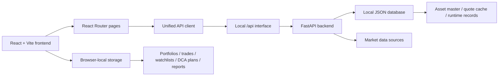

# FundX English

[简体中文](readme.zh-CN.md) · [繁體中文](readme.zh-TW.md) · [Back to README](../README.md)

---

## Positioning

FundX is a local US-market portfolio management system. It combines asset discovery, fund screening, stock tracking, portfolio construction, DCA simulation, custom fund modeling, asset comparison, watchlists, and investment reporting in one workspace.

It is designed for personal investment research, long-term portfolio tracking, fund and stock comparison, recurring investment planning, rebalance analysis, and local report storage.

## Problems It Solves

| Problem | FundX Approach |
| --- | --- |
| Research is scattered | Manage funds, stocks, portfolios, watchlists, and reports in one system. |
| Portfolios are hard to review | Track snapshots, value curves, return metrics, and allocation structure. |
| DCA outcomes are unclear | Simulate frequency, amount, fees, dividend reinvestment, and cash-flow results. |
| Custom baskets lack structure | Validate weights, review sector exposure, inspect contribution, and compare performance. |
| Fund comparison is fragmented | Compare return, volatility, drawdown, fee, dividend, and holding differences side by side. |
| Personal records should stay local | Portfolios, trades, DCA plans, watchlists, and reports are stored in browser-local storage by default. |

## Feature Map

| Module | Purpose | Key Capabilities |
| --- | --- | --- |
| Home | Investment workspace landing page | Overview, value curve, core metrics, top stocks, and top funds. |
| Discover | Asset discovery | Search funds and stocks, filter by type, sector, keyword, and metrics. |
| Asset Detail | Security detail page | Review profile, quote status, history, and available actions. |
| Portfolio | Portfolio management | Edit holdings, target weights, trades, cash flows, and snapshots. |
| DCA Lab | Recurring investment simulation | Configure contribution schedule, amount, fees, dividend reinvestment, curves, and cash-flow rows. |
| Custom Fund | Custom basket builder | Create weighted US-asset baskets and inspect exposure, weights, and performance. |
| Compare | Multi-asset comparison | Compare return, volatility, drawdown, fees, dividends, and holdings. |
| Watchlist | Tracked asset list | Save selected assets, refresh quote status, and open detail pages quickly. |
| Insights | Research memory | Save allocation notes, asset conclusions, and reusable analysis results. |
| Reports | Investment reporting | Generate allocation, performance, holdings, and conclusion reports. |
| Settings | System preferences | Configure language, theme, market colors, import/export, and data-source status. |

## Core Workflows

### Research Assets

1. Search funds or stocks in Discover.
2. Open detail pages to review asset information and quote status.
3. Add candidates to Watchlist or Compare.
4. Save conclusions in Insights or Reports.

### Build A Portfolio

1. Enter holdings, target weights, transactions, and cash flows in Portfolio.
2. Review snapshots, value curves, and allocation structure.
3. Use Compare to evaluate candidates against current positions.
4. Generate a report to record the portfolio decision.

### Plan DCA

1. Select a fund or asset in DCA Lab.
2. Configure contribution frequency, amount, fees, and dividend reinvestment.
3. Review cash-flow rows, result curves, and return metrics.
4. Move the selected plan into portfolio tracking.

### Create A Custom Fund

1. Select US assets in Custom Fund.
2. Set component weights and validate total allocation.
3. Review sector exposure, contribution, and performance curves.
4. Use the custom fund in comparison, portfolio planning, or reporting.

## System Design



### Frontend

- Built with React, TypeScript, Vite, React Router, Tailwind CSS, and Zustand.
- Core pages are organized around investment workflows inside one application shell.
- API calls go through a unified client for local proxying and same-origin serving.
- Personal investment records are stored in browser-local storage by default and can be imported or exported.

### Backend

- FastAPI provides the local `/api` service.
- The backend handles asset search, quote refresh, portfolio calculation, DCA calculation, comparison outputs, and report data.
- The local JSON database stores public asset records, quote cache, background jobs, and runtime records.
- When a market data source is unavailable, the system keeps an explicit data state instead of creating fake prices or fake history.

### Data Boundary

| Data Type | Storage | Notes |
| --- | --- | --- |
| Public asset universe | Local JSON database | Funds, stocks, base classification, and quote cache. |
| Quote refresh records | Local JSON database | Latest refresh status, source, and runtime records. |
| Portfolios and trades | Browser-local storage | Holdings, transactions, cash flows, and snapshots. |
| DCA plans | Browser-local storage | Contribution settings, result curves, and cash-flow rows. |
| Watchlists and reports | Browser-local storage | Personal watchlists, report drafts, and review records. |

## Local Deployment

### Requirements

- Node.js 20 or newer
- Python 3.11 or newer
- npm

### Install Dependencies

```bash
npm install
python3 -m pip install -r requirements.txt
```

### Prepare Environment And Database

```bash
cp .env.example .env.local
node scripts/db.mjs init
node scripts/db.mjs migrate
```

### Start Backend

```bash
npm run dev:api
```

The backend listens on:

```text
http://127.0.0.1:8000
```

### Start Frontend

```bash
npm run dev
```

Open:

```text
http://localhost:3000
```

During local development, frontend `/api` requests are proxied to the FastAPI backend.

## Local Production Mode

Build the frontend:

```bash
npm run build
```

Start the backend:

```bash
npm run serve:api
```

Start the frontend preview server:

```bash
npm run serve:web
```

In local production mode, the backend listens on `0.0.0.0:8000`, and the frontend preview service listens on `0.0.0.0:3000`.

## Project Structure

| Path | Purpose |
| --- | --- |
| `src/` | Frontend app, pages, components, state, and API client. |
| `backend/app/` | FastAPI backend service and business endpoints. |
| `seed/` | Public asset-universe seed data. |
| `data/` | Local runtime database directory. |
| `scripts/` | Database initialization, migration, and local runtime commands. |

## Data Notes

FundX focuses on the US market, USD, US sector classification, and common US benchmarks. The system includes public asset data and maintains a local quote cache. Personal investment records and reports stay in browser-local storage by default, with import and export support.

## Entry Point

After local startup, open:

```text
http://localhost:3000
```

FundX opens directly into the Home workspace. Use the navigation to access Discover, Portfolio, DCA Lab, Custom Fund, Compare, Watchlist, Insights, Reports, and Settings.
