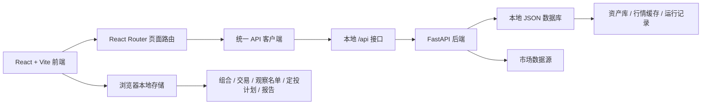

# FundX 简体中文

[English](readme.en.md) · [繁體中文](readme.zh-TW.md) · [返回首页](../README.md)

---

## 系统定位

FundX 是一个面向美股市场的本地投资组合管理系统。它把资产发现、基金筛选、股票跟踪、组合构建、定投模拟、自定义基金、资产比较、观察名单和投资报告整合到同一个工作台中。

它适合用于个人投资研究、长期组合跟踪、基金与股票横向比较、定投计划测算、持仓再平衡分析，以及本地保存投资报告。

## 它解决什么问题

| 问题 | FundX 的处理方式 |
| --- | --- |
| 资产研究分散 | 把基金、股票、组合、观察名单和报告放在同一套系统里。 |
| 组合难以复盘 | 用组合快照、资产曲线、收益指标和持仓结构记录变化。 |
| 定投结果不直观 | 通过 DCA 模拟器计算投入频率、金额、费用、股息再投和现金流结果。 |
| 自建组合缺少结构分析 | 自定义基金支持权重校验、行业暴露、成分贡献和收益表现。 |
| 基金比较碎片化 | 比较收益、波动、回撤、费率、股息和持仓差异。 |
| 个人记录不适合外放 | 组合、交易、定投计划、观察名单和报告默认保存在浏览器本地。 |

## 功能全景

| 模块 | 用途 | 关键能力 |
| --- | --- | --- |
| Home | 投资工作台首页 | 总览、资产曲线、核心指标、Top 股票、Top 基金。 |
| Discover | 资产发现 | 搜索基金和股票，按类型、行业、关键词和指标筛选。 |
| Asset Detail | 资产详情 | 查看基本信息、行情状态、历史表现和相关操作入口。 |
| Portfolio | 组合管理 | 编辑持仓、目标权重、交易记录、现金流和组合快照。 |
| DCA Lab | 定投模拟 | 设置投入频率、金额、费用、股息再投，生成结果曲线和现金流明细。 |
| Custom Fund | 自定义基金 | 从美股资产池创建加权组合，查看行业暴露、权重结构和收益表现。 |
| Compare | 多资产比较 | 横向比较收益、波动、回撤、费用、股息和持仓。 |
| Watchlist | 观察名单 | 保存关注资产，刷新价格状态，快速进入详情页。 |
| Insights | 投资洞察 | 保存组合结论、资产建议和分析结果，便于后续复盘。 |
| Reports | 投资报告 | 生成组合结构、表现曲线、持仓明细和关键结论。 |
| Settings | 系统设置 | 配置语言、主题、市场颜色、数据导入导出和数据源状态。 |

## 典型使用流程

### 研究资产

1. 在 Discover 中搜索基金或股票。
2. 进入详情页查看资产信息和行情状态。
3. 把候选资产加入 Watchlist 或 Compare。
4. 将筛选结果沉淀到 Insights 或 Reports。

### 构建组合

1. 在 Portfolio 中录入持仓、目标权重和交易记录。
2. 查看组合快照、资产曲线和配置结构。
3. 使用 Compare 检查候选资产与现有持仓的差异。
4. 生成报告，记录本次组合调整逻辑。

### 测算定投

1. 在 DCA Lab 中选择基金或资产。
2. 设置投入频率、金额、费用和股息再投方式。
3. 查看现金流明细、结果曲线和收益指标。
4. 将可执行计划转入组合跟踪。

### 创建自定义基金

1. 在 Custom Fund 中选择美股资产。
2. 设置各成分权重并检查总权重。
3. 查看行业暴露、成分贡献和表现曲线。
4. 将自定义基金用于比较、组合或报告。

## 系统设计



### 前端

- 使用 React、TypeScript、Vite、React Router、Tailwind CSS 和 Zustand。
- 页面围绕投资工作流组织，所有核心模块都在同一个应用壳层中切换。
- API 请求通过统一客户端发出，便于本地代理和同源部署。
- 用户个人投资数据默认保存在浏览器本地，并支持导入导出。

### 后端

- 使用 FastAPI 提供本地 `/api` 服务。
- 负责资产查询、行情刷新、组合计算、定投计算、比较结果和报告数据。
- 本地 JSON 数据库保存公开资产数据、行情缓存、后台任务和运行记录。
- 当数据源不可用时，系统保留明确状态，不生成虚假价格或虚假历史曲线。

### 数据边界

| 数据类型 | 保存位置 | 说明 |
| --- | --- | --- |
| 公开资产库 | 本地 JSON 数据库 | 基金、股票、基础分类和行情缓存。 |
| 行情刷新记录 | 本地 JSON 数据库 | 保存最近刷新状态、来源和运行记录。 |
| 组合与交易 | 浏览器本地存储 | 用户持仓、交易、现金流和组合快照。 |
| 定投计划 | 浏览器本地存储 | 投入设置、结果曲线和现金流明细。 |
| 观察名单与报告 | 浏览器本地存储 | 个人关注列表、报告草稿和复盘记录。 |

## 本地部署

### 环境要求

- Node.js 20 或更高版本
- Python 3.11 或更高版本
- npm

### 安装依赖

```bash
npm install
python3 -m pip install -r requirements.txt
```

### 准备环境文件和数据库

```bash
cp .env.example .env.local
node scripts/db.mjs init
node scripts/db.mjs migrate
```

### 启动后端

```bash
npm run dev:api
```

后端默认监听：

```text
http://127.0.0.1:8000
```

### 启动前端

```bash
npm run dev
```

前端默认访问地址：

```text
http://localhost:3000
```

本地开发时，前端的 `/api` 请求会自动代理到 FastAPI 后端。

## 本地生产模式

构建前端产物：

```bash
npm run build
```

启动后端服务：

```bash
npm run serve:api
```

启动前端预览服务：

```bash
npm run serve:web
```

本地生产模式下，后端监听 `0.0.0.0:8000`，前端预览服务监听 `0.0.0.0:3000`。

## 项目结构

| 路径 | 作用 |
| --- | --- |
| `src/` | 前端应用、页面、组件、状态和 API 客户端。 |
| `backend/app/` | FastAPI 后端服务和业务接口。 |
| `seed/` | 公开资产库初始数据。 |
| `data/` | 本地运行数据库目录。 |
| `scripts/` | 数据库初始化、迁移和本地运行辅助命令。 |

## 数据说明

FundX 聚焦美股市场，使用 USD、美股行业分类和常见美股基准。系统内置公开资产数据，并在本地数据库中维护行情缓存。用户自己的投资记录与报告默认留在浏览器本地，便于个人使用、导入和导出。

## 页面入口

本地启动后直接打开：

```text
http://localhost:3000
```

系统会默认进入 Home 工作台。通过左侧导航可以进入 Discover、Portfolio、DCA Lab、Custom Fund、Compare、Watchlist、Insights、Reports 和 Settings。
