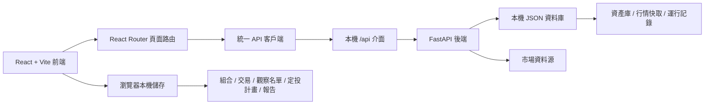

# FundX 繁體中文

[简体中文](readme.zh-CN.md) · [English](readme.en.md) · [返回首頁](../README.md)

---

## 系統定位

FundX 是一個面向美股市場的本機投資組合管理系統。它把資產發現、基金篩選、股票追蹤、組合建構、定投模擬、自訂基金、資產比較、觀察名單與投資報告整合到同一個工作台中。

它適合用於個人投資研究、長期組合追蹤、基金與股票橫向比較、定投計畫測算、持倉再平衡分析，以及本機保存投資報告。

## 它解決什麼問題

| 問題 | FundX 的處理方式 |
| --- | --- |
| 資產研究分散 | 把基金、股票、組合、觀察名單與報告放在同一套系統裡。 |
| 組合難以複盤 | 用組合快照、資產曲線、收益指標與持倉結構記錄變化。 |
| 定投結果不直觀 | 透過 DCA 模擬器計算投入頻率、金額、費用、股息再投與現金流結果。 |
| 自建組合缺少結構分析 | 自訂基金支援權重校驗、行業暴露、成分貢獻與收益表現。 |
| 基金比較碎片化 | 比較收益、波動、回撤、費率、股息與持倉差異。 |
| 個人記錄適合留在本機 | 組合、交易、定投計畫、觀察名單與報告預設保存在瀏覽器本機。 |

## 功能全景

| 模組 | 用途 | 關鍵能力 |
| --- | --- | --- |
| Home | 投資工作台首頁 | 總覽、資產曲線、核心指標、Top 股票、Top 基金。 |
| Discover | 資產發現 | 搜尋基金和股票，按類型、行業、關鍵字和指標篩選。 |
| Asset Detail | 資產詳情 | 查看基本資訊、行情狀態、歷史表現和相關操作入口。 |
| Portfolio | 組合管理 | 編輯持倉、目標權重、交易記錄、現金流和組合快照。 |
| DCA Lab | 定投模擬 | 設定投入頻率、金額、費用、股息再投，生成結果曲線和現金流明細。 |
| Custom Fund | 自訂基金 | 從美股資產池建立加權組合，查看行業暴露、權重結構和收益表現。 |
| Compare | 多資產比較 | 橫向比較收益、波動、回撤、費用、股息和持倉。 |
| Watchlist | 觀察名單 | 保存關注資產，刷新價格狀態，快速進入詳情頁。 |
| Insights | 投資洞察 | 保存組合結論、資產建議和分析結果，便於後續複盤。 |
| Reports | 投資報告 | 生成組合結構、表現曲線、持倉明細和關鍵結論。 |
| Settings | 系統設定 | 配置語言、主題、市場顏色、資料匯入匯出和資料源狀態。 |

## 典型使用流程

### 研究資產

1. 在 Discover 中搜尋基金或股票。
2. 進入詳情頁查看資產資訊和行情狀態。
3. 把候選資產加入 Watchlist 或 Compare。
4. 將篩選結果沉澱到 Insights 或 Reports。

### 建構組合

1. 在 Portfolio 中錄入持倉、目標權重和交易記錄。
2. 查看組合快照、資產曲線和配置結構。
3. 使用 Compare 檢查候選資產與現有持倉的差異。
4. 生成報告，記錄本次組合調整邏輯。

### 測算定投

1. 在 DCA Lab 中選擇基金或資產。
2. 設定投入頻率、金額、費用和股息再投方式。
3. 查看現金流明細、結果曲線和收益指標。
4. 將可執行計畫轉入組合追蹤。

### 建立自訂基金

1. 在 Custom Fund 中選擇美股資產。
2. 設定各成分權重並檢查總權重。
3. 查看行業暴露、成分貢獻和表現曲線。
4. 將自訂基金用於比較、組合或報告。

## 系統設計



### 前端

- 使用 React、TypeScript、Vite、React Router、Tailwind CSS 與 Zustand。
- 頁面圍繞投資工作流組織，所有核心模組都在同一個應用殼層中切換。
- API 請求透過統一客戶端發出，便於本機代理和同源部署。
- 使用者個人投資資料預設保存在瀏覽器本機，並支援匯入匯出。

### 後端

- 使用 FastAPI 提供本機 `/api` 服務。
- 負責資產查詢、行情刷新、組合計算、定投計算、比較結果和報告資料。
- 本機 JSON 資料庫保存公開資產資料、行情快取、後台任務和運行記錄。
- 當資料源不可用時，系統保留明確狀態，不生成虛假價格或虛假歷史曲線。

### 資料邊界

| 資料類型 | 保存位置 | 說明 |
| --- | --- | --- |
| 公開資產庫 | 本機 JSON 資料庫 | 基金、股票、基礎分類和行情快取。 |
| 行情刷新記錄 | 本機 JSON 資料庫 | 保存最近刷新狀態、來源和運行記錄。 |
| 組合與交易 | 瀏覽器本機儲存 | 使用者持倉、交易、現金流和組合快照。 |
| 定投計畫 | 瀏覽器本機儲存 | 投入設定、結果曲線和現金流明細。 |
| 觀察名單與報告 | 瀏覽器本機儲存 | 個人關注列表、報告草稿和複盤記錄。 |

## 本機部署

### 環境要求

- Node.js 20 或更高版本
- Python 3.11 或更高版本
- npm

### 安裝依賴

```bash
npm install
python3 -m pip install -r requirements.txt
```

### 準備環境文件和資料庫

```bash
cp .env.example .env.local
node scripts/db.mjs init
node scripts/db.mjs migrate
```

### 啟動後端

```bash
npm run dev:api
```

後端預設監聽：

```text
http://127.0.0.1:8000
```

### 啟動前端

```bash
npm run dev
```

前端預設訪問地址：

```text
http://localhost:3000
```

本機開發時，前端的 `/api` 請求會自動代理到 FastAPI 後端。

## 本機生產模式

建置前端產物：

```bash
npm run build
```

啟動後端服務：

```bash
npm run serve:api
```

啟動前端預覽服務：

```bash
npm run serve:web
```

本機生產模式下，後端監聽 `0.0.0.0:8000`，前端預覽服務監聽 `0.0.0.0:3000`。

## 專案結構

| 路徑 | 作用 |
| --- | --- |
| `src/` | 前端應用、頁面、元件、狀態和 API 客戶端。 |
| `backend/app/` | FastAPI 後端服務和業務介面。 |
| `seed/` | 公開資產庫初始資料。 |
| `data/` | 本機運行資料庫目錄。 |
| `scripts/` | 資料庫初始化、遷移和本機運行輔助命令。 |

## 資料說明

FundX 聚焦美股市場，使用 USD、美股行業分類和常見美股基準。系統內置公開資產資料，並在本機資料庫中維護行情快取。使用者自己的投資記錄與報告預設留在瀏覽器本機，便於個人使用、匯入和匯出。

## 頁面入口

本機啟動後直接打開：

```text
http://localhost:3000
```

系統會預設進入 Home 工作台。透過左側導覽可以進入 Discover、Portfolio、DCA Lab、Custom Fund、Compare、Watchlist、Insights、Reports 和 Settings。
